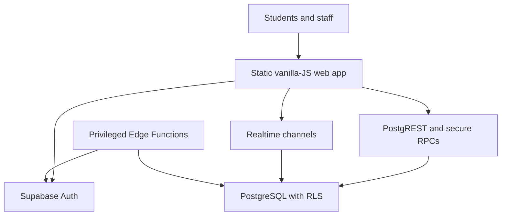
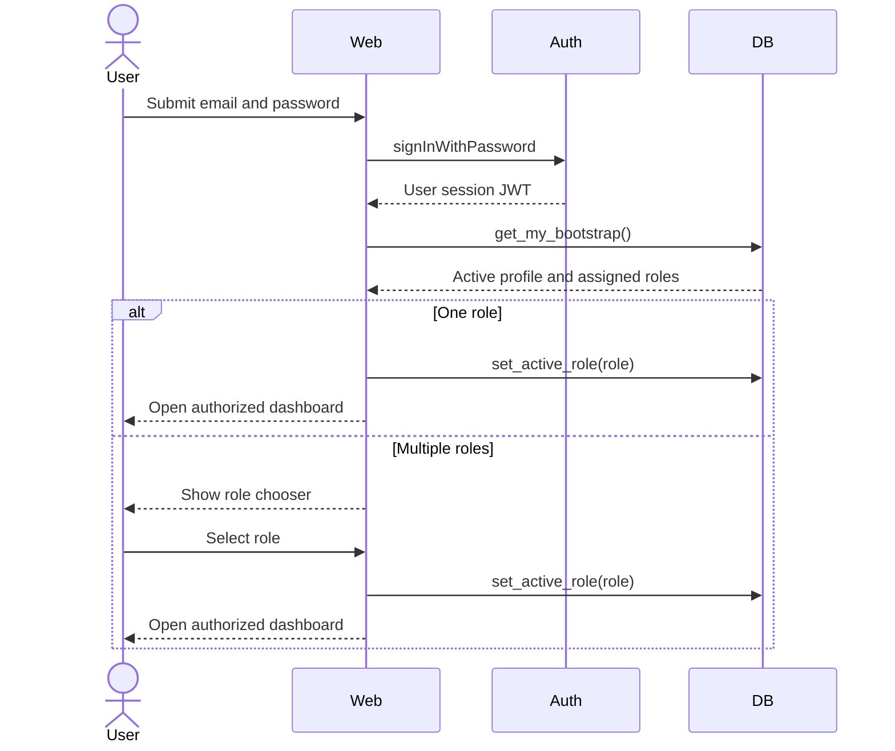
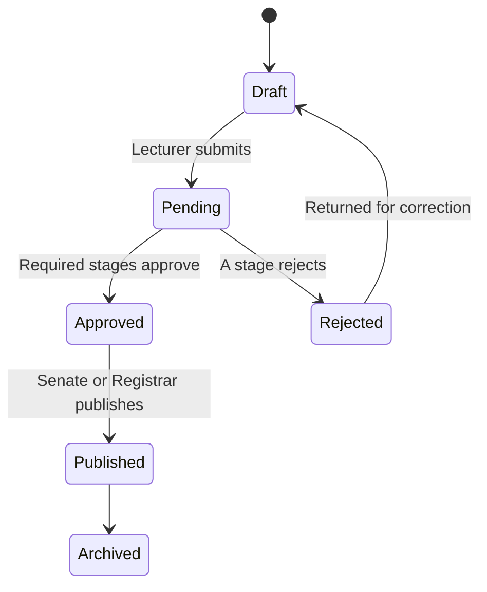

# Architecture

## System context

The browser possesses only the public anon key and the signed-in user JWT. PostgreSQL Row-Level Security authorizes every data request. The browser cannot choose a role it has not been assigned because `set_active_role` checks `user_roles` inside a security-definer function.

## Authentication and routing sequence

## Academic result workflow

Database triggers reject score changes after approval or publication. Decisions are transactional RPC calls that lock the approval row, authorize the current stage and create an audit record.

## Key design decisions

| Decision | Reason |
|---|---|
| Self-contained public `index.html` | Meets the single-page landing requirement and simplifies reliable public deployment. |
| Shared authenticated modules | Prevents seventeen copies of auth and data-access code from diverging. |
| Separate role HTML entry points | Provides explicit URLs, CSP boundaries and predictable routing. |
| Database-first authorization | UI visibility is convenience; RLS and RPC checks remain authoritative. |
| Plain text/structured JSON content | Avoids storing executable HTML and reduces stored-XSS exposure. |
| Server-only user/role administration | Keeps the service-role key and Auth Admin API out of the browser. |
| Local tutorial media | Removes availability, tracking and licensing dependencies on a video host. |

## Role surfaces

| Role | Primary modules |
|---|---|
| Developer / Administrator | Users, courses, examinations, audit |
| Lecturer | Examinations, learning, assignments, results, research |
| Student | Learning, assignments, results, records, research, transcripts |
| Coordinator / DEO / HOD / Faculty / Senate | Results and staged approvals at the assigned scope |
| Registrar | Records, transcripts, published results |
| Vice-Chancellor | Institutional results, research and audit indicators |
| External Examiner | Examinations, results and external review |
| Supervisor / PG Coordinator | Research projects and milestones |
| Invigilator | Live examination operations |
| Help Desk | User support and permitted audit evidence |
| Transcript Verification | Verification request records only |
